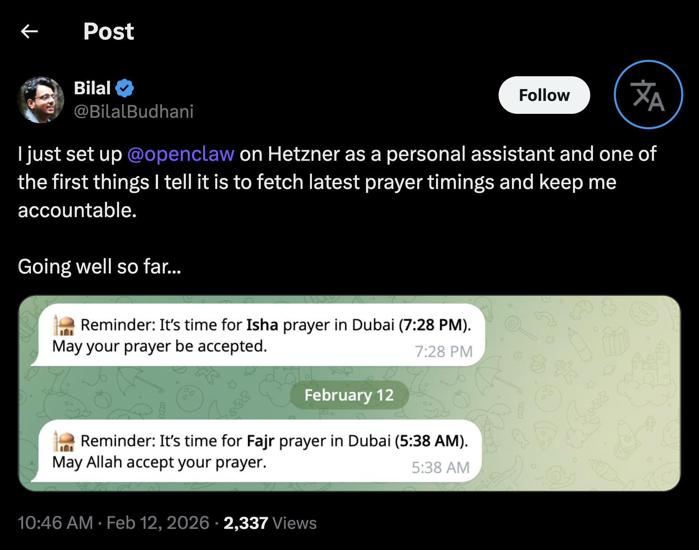

# مترجم التغريدات إلى العربية 🌐

إضافة بسيطة لمتصفح Google Chrome تترجم أي تغريدة على منصة X (تويتر سابقاً) إلى اللغة العربية بضغطة زر واحدة.

## كيف تعمل؟

- تظهر أيقونة ترجمة صغيرة بجانب اسم ناشر كل تغريدة
- اضغط عليها لترجمة التغريدة إلى العربية
- اضغط مرة أخرى لإرجاع النص الأصلي

## التثبيت

1. حمّل المشروع أو انسخه إلى جهازك
2. افتح متصفح Chrome واذهب إلى `chrome://extensions/`
3. فعّل **وضع المطور** (Developer mode) من أعلى الصفحة
4. اضغط على **Load unpacked**
5. اختر مجلد `tweet-translator`
6. افتح أي تغريدة على [x.com](https://x.com) واستمتع!

## الملفات

| الملف | الوصف |
|---|---|
| `manifest.json` | إعدادات الإضافة |
| `content.js` | السكربت الرئيسي |
| `styles.css` | تنسيق الأيقونة |
| `icons/` | أيقونات الإضافة |

## المتصفحات المدعومة

- Google Chrome
- Microsoft Edge
- Brave
- Opera / Opera GX
- Vivaldi
- Arc
- أي متصفح مبني على Chromium

## ملاحظات

- الترجمة تتم عبر Google Translate بدون الحاجة لمفتاح API
- تدعم الترجمة من أي لغة إلى العربية تلقائياً
- تعمل مع التغريدات التي تُحمّل ديناميكياً أثناء التصفح
